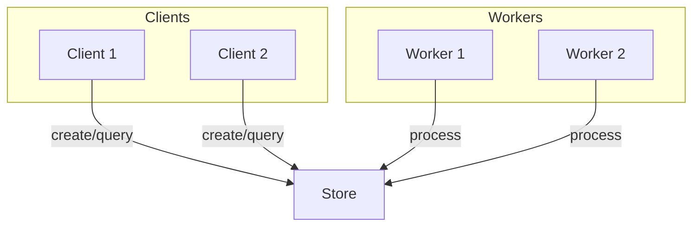

# Starflow

A workflow engine for Go that enables deterministic, resumable, and distributed workflow execution using Starlark scripting.

## Features

### Deterministic & Durable Workflows
Write workflows in Starlark (Python-like syntax) that are deterministic and can be replayed from any point with full durability guarantees. 
Every execution step is recorded and can be resumed exactly where it left off.

### Pluggable Backends
Support for in-memory, DynamoDB, and PostgreSQL storage with easy extensibility for custom backends. 
Choose the storage solution that fits your deployment environment and scale requirements.

## Installation

```bash
go get github.com/dynoinc/starflow
```

## Quick Start

```go
package main

import (
    "context"
    "time"
    
    "github.com/dynoinc/starflow"
    "google.golang.org/protobuf/types/known/wrapperspb"
)

func main() {
    // Create an in-memory store
    store := starflow.NewInMemoryStore()
    
    // Create a worker
    worker := starflow.NewWorker[*wrapperspb.StringValue, *wrapperspb.StringValue](store, 10*time.Millisecond)
    
    // Register your functions
    echoFn := func(ctx context.Context, req *wrapperspb.StringValue) (*wrapperspb.StringValue, error) {
        return &wrapperspb.StringValue{Value: "echo: " + req.Value}, nil
    }
    starflow.Register(worker, echoFn, starflow.WithName("echoFn"))
    
    // Create a client
    client := starflow.NewClient[*wrapperspb.StringValue](store)
    
    // Define your workflow script
    script := `
load("proto", "proto")

def main(ctx, input):
    # Use well-known protobuf types
    stringvalue_proto = proto.file("google/protobuf/wrappers.proto")
    
    # Call our registered function
    result = echoFn(ctx=ctx, req=stringvalue_proto.StringValue(value=input.value))
    
    # Return the result
    return result
`
    
    // Run the workflow
    runID, err := client.Run(context.Background(), []byte(script), &wrapperspb.StringValue{Value: "hello"})
    if err != nil {
        panic(err)
    }
    
    // Process the workflow
    worker.ProcessOnce(context.Background())
    
    // Get the result
    run, err := client.GetRun(context.Background(), runID)
    if err != nil {
        panic(err)
    }
    
    var output wrapperspb.StringValue
    run.Output.UnmarshalTo(&output)
    println("Result:", output.Value)
}
```

## Development

### Prerequisites

- Go 1.21 or later
- Docker (for backend tests)

### Setup

1. Clone the repository:
```bash
git clone https://github.com/dynoinc/starflow.git
cd starflow
```

2. Install dependencies:
```bash
go mod download
```

### Testing

Run the full test suite:
```bash
just test
```

Or run specific commands:
```bash
just gen    # Generate code and format imports
just lint   # Run linting and security checks
```

### Available Commands

- `just` or `just test` - Run the full test suite
- `just gen` - Generate code and format imports
- `just lint` - Run linting and security checks

## Architecture

Starflow consists of several key components:



- **Store**: Central component that persists workflow state and events
- **Client**: Used to create and query workflow runs
- **Worker**: Processes workflow runs and executes functions
- **Event System**: Records all workflow activities for replay

## Backends

Starflow supports multiple storage backends:

- **In-Memory**: For development and testing
- **DynamoDB**: For production AWS deployments
- **PostgreSQL**: For production deployments with relational databases

## Contributing

1. Fork the repository
2. Create a feature branch
3. Make your changes
4. Add tests for new functionality
5. Run the test suite
6. Submit a pull request

## License

This project is licensed under the MIT License - see the [LICENSE](LICENSE) file for details.

## Security

Please see [SECURITY.md](SECURITY.md) for security policy and reporting guidelines. 